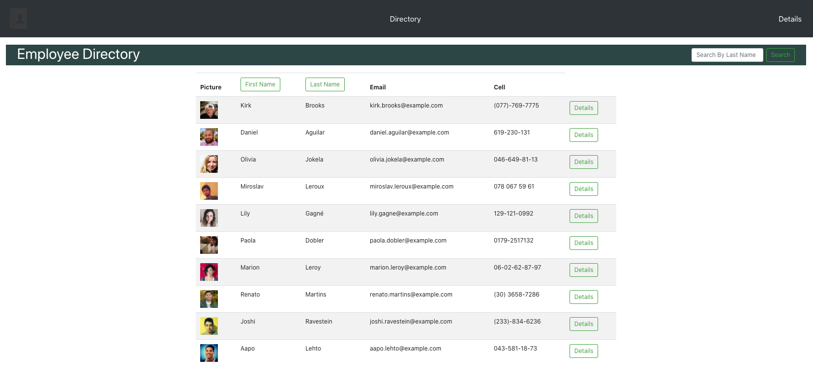

# Employee Directory - React App

This app is made with React. It is a simple employee directory where users can find information about employees, like the name, the email address, the phone number, etc.

This app has two pages: 
* the directory, where users get a list of employees for a quick view.
* the details page, where users get more detailed information about a specific employee.

The search feature is included in all the pages for easier access. You can search for any keyword and almost immediately you will get the results.
- - -
### URL of the GitHub Repository

[GitHub Repo for Employee Directory](https://github.com/tomaspz/react-employee-directory)
- - -
### App Screenshot

- - -
### Instructions for Development

This project was bootstrapped with [Create React App](https://github.com/facebook/create-react-app). Also the [Create React App documentation](https://facebook.github.io/create-react-app/docs/getting-started) provides much more information. To learn React, check the [React documentation](https://reactjs.org/).

* To use the app in development mode run `yarn start` at the CLI. Open [http://localhost:3000](http://localhost:3000) to view the app in the browser. The page will reload if you make edits. You will also see any lint errors in the console.

* To use the app in test mode run `yarn test`at the CLI. This command launches the test runner in the interactive watch mode. See [running tests](https://facebook.github.io/create-react-app/docs/running-tests) for more information.

* To use the app in production mode run `yarn build` at the CLI. This command builds the app for production to the `build` folder. It correctly bundles React in production mode and optimizes the build for the best performance. The build is minified and the filenames include the hashes. Now the app is ready to be deployed!. See [deployment](https://facebook.github.io/create-react-app/docs/deployment) for more information.